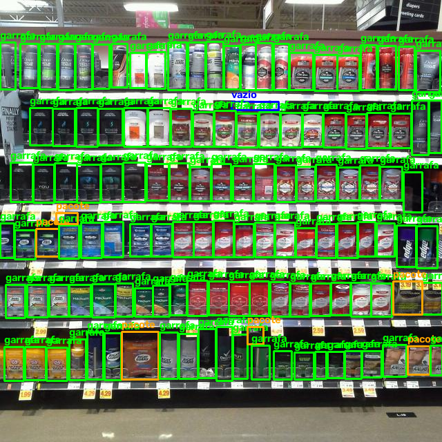
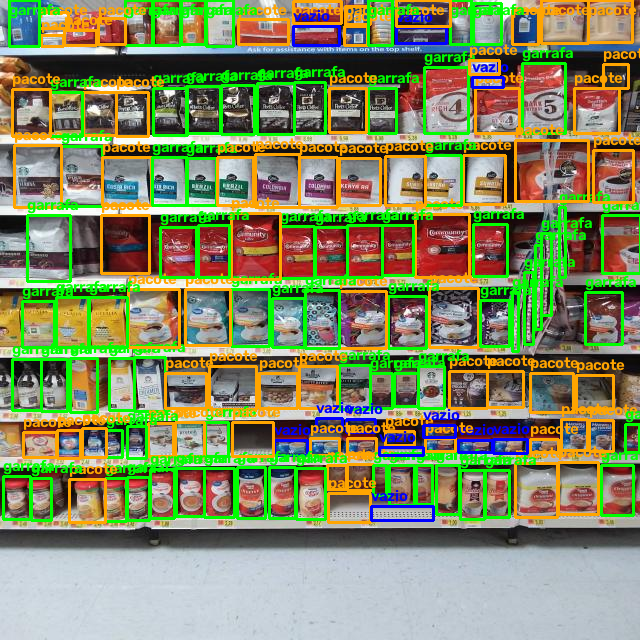
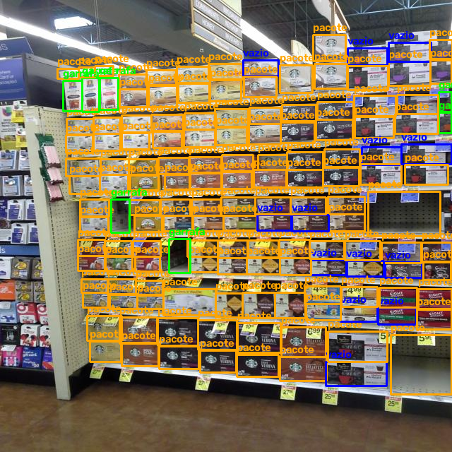
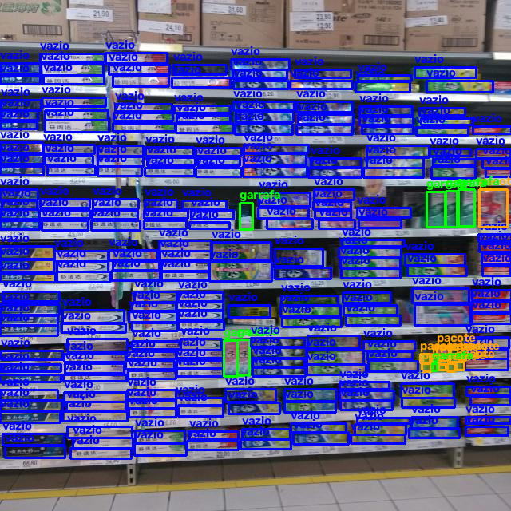
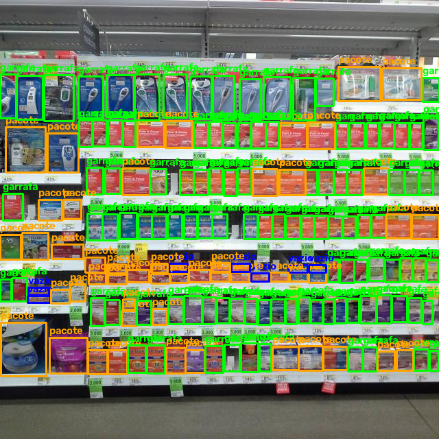
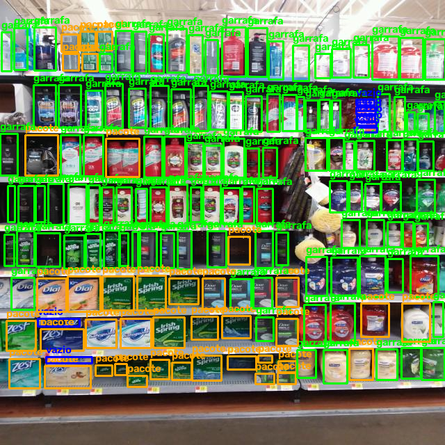
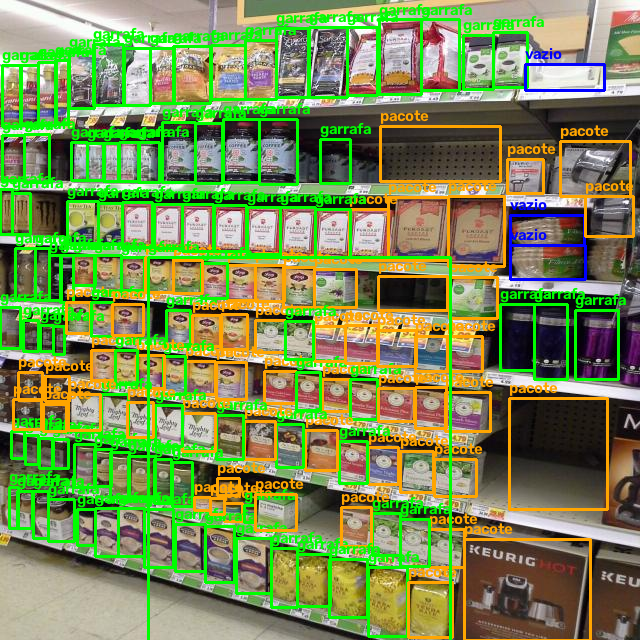
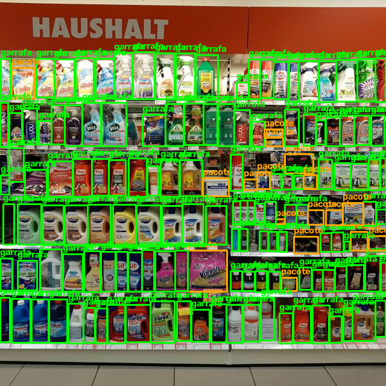

# Auditoria Inteligente de Gôndolas no Varejo via Visão Computacional

> **Trabalho de Sistematização — Pós-Graduação em Visão Computacional e Reconhecimento de Padrões**  
> **Instituição:** CEUB (Centro de Ensino Unificado de Brasília)  
> **Orientador:** Prof. Romes Heriberto Pires de Araujo

---

## Trabalho Individual

* **Homério Parreira da Silva Junior** — *Desenvolvimento, Pipeline e Modelagem*

---

## Vídeo-Pitch e Demonstração do Sistema

* **Link do Vídeo (YouTube / Drive):** [Cole o Link Aqui]
* **Duração:** ~6 minutos
* **Conteúdo:** Apresentação da arquitetura, pipeline de dados, treino dos modelos e demonstração da inferência em tempo real com rastreamento de gôndola.

---

## 1. Definição do Problema e Cenário de Aplicação

No setor varejista (supermercados e atacados), a monitoria contínua de prateleiras é crítica. A indisponibilidade de produtos nas gôndolas (*out-of-stock* ou rupturas) reduz vendas, gera perdas financeiras e compromete a experiência do consumidor. Atualmente, auditorias manuais são caras e pouco escaláveis, o que abre espaço para soluções de visão computacional.

### Objetivos do Projeto:
1. **Detecção e Classificação de Produtos** — localizar e identificar automaticamente itens dispostos em prateleiras, permitindo auditoria contínua.  
2. **Identificação de Vazio/Ruptura** — detectar lacunas e espaços vazios em tempo real, auxiliando na reposição imediata.  
3. **Segmentação de Instâncias (Fase Avançada)** — refinar a delineação de embalagens sobrepostas e garrafas usando máscaras do **SAM (Segment Anything Model)**, aumentando a precisão em cenários complexos.  
4. **Rastreamento Dinâmico em Vídeo** — aplicar rastreamento multi-objeto (**ByteTrack**) para contagem contínua durante inspeções em vídeo, simulando a visão de um auditor humano em escala.  

O sistema proposto busca oferecer uma solução escalável, automatizada e integrável a sistemas de estoque, reduzindo custos e aumentando a eficiência operacional no varejo.

---

## 2. Dataset e Análise Exploratória dos Dados (EDA)

O dataset utilizado foi derivado e curado a partir do *Retail Shelf Object Detection*, disponível por licença publica em [https://universe.roboflow.com/retailshelfobjectdetection/retail-shelf-object-detection/dataset/2]. Este dataset, que possuia apenas duas classes: objetc (referente a objeto detectado) e empty(espaço vazio) foi analisado em busca das imagens, filtrado e reanotado para ser utilizado neste projeto.

### Mapeamento das 4 Classes Estratégicas:
* **0 - `garrafa`**: Bebidas, óleos, produtos de limpeza altos e cilíndricos.
* **1 - `pacote`**: Embalagens flexíveis (biscoitos, pães, grãos).
* **2 - `fardo_caixa`**: Caixas de papelão e fardos de produtos.
* **3 - `vazio`**: Espaços de ruptura na gôndola.

### Metodologia de Tratamento dos Dados:
1. **Filtro de Nitidez (Laplaciano)**: Seleção das **TOP 450 imagens** de maior qualidade com base na pontuação:
   $$\text{Score} = \text{Variância(Laplaciano)} \times (1 + 0.05 \times \text{Nº de Objetos})$$   
3. **Divisão Rígida (Splits)**: 70% Treino | 15% Validação | 15% Teste (Inédito).
4. **Geração de Máscaras com SAM**: Utilização do **MobileSAM** para conversão de Bounding Boxes em polígonos de segmentação binária.

### Analise do Dataset

Após a identificação das melhores imagens e separação dos novos conjuntos de treino, validação e teste ficamos com um total de 450 imagens distribuídas da seguinte forma: Treino (315),  Validação (67) e Teste (68). Foram gravados no dataset abaixo. 

 **Link do Dataset Oficial no Kaggle:** [homeriojr/sistematizacao-visao-computacional](https://www.kaggle.com/datasets/homeriojr/sistematizacao-visao-computacional)  

Realizado a reanotação usando o SAM para identificar as novas classes foram obtidas nas 450 imagens a detecção de 72409 detecções distribuídas conforme abaixo:

#### Tabela Resumo de Objetos por Classe e Split

| Classe        | Teste | Treino | Validação | Total |
|---------------|-------|--------|-----------|-------|
| 📊 **fardo_caixa** | 5     | 33     | 2         | 40    |
| 🍾 **garrafa**     | 4933  | 24417  | 5544      | 34894 |
| 📦 **pacote**      | 4323  | 18046  | 3267      | 25636 |
| 🚫 **vazio**       | 1877  | 7940   | 2022      | 11839 |
| 🔢 **Total**       | 11138 | 50436  | 10835     | 72409 |

  

  Foi realizado a observação visual de amostra das imagens, conforme imagem abaixo e que se encontram neste repositório na pasta amostras. Abaixo estão 8 imagens selecionadas aleatoriamente do conjunto de treino, já anotadas com bounding boxes e classes:

  
  
  
  

  
  
  
  

Com essa analise foi identificado boa identificação da classe garrafas mas ainda com falhas principalmente quanto a classe vazio e pacotes em pontos vazios. Também foram identificadas várias sobreposições de pontos principalmente em locais com grande adensamento de produtos ou onde a cor dos produtos se assemelha as prateleiras. 

**Limitação identificada**: Diante da limitação observada foram realizadas novos testes de reanotação com novos parametros mas ainda assim houve mais falhas. Foi tentado uso de outras ferramentas como roboflow para identificação automatica com uso de SAM e GPT (OLARA) mas mais uma vez identificou-se o aumento das falhas. 
  

---

## 3. Metodologia, Arquitetura e Hiperparâmetros

| Parâmetro | Configuração Detecção | Configuração Segmentação |
|---|---|---|
| **Modelo Base** | YOLO11 Nano (`yolo11n.pt`) | YOLO11 Nano Segmentação (`yolo11n-seg.pt`) |
| **Épocas** | 40 | 40 |
| **Tamanho da Imagem (`imgsz`)** | 640x640 | 640x640 |
| **Batch Size** | 16 | 16 |
| **Otimizador** | Auto (AdamW / SGD) | Auto (AdamW / SGD) |
| **Seed de Reprodutibilidade** | 42 | 42 |
| **Hardware** | Kaggle GPU NVIDIA P100 / T4 | Kaggle GPU NVIDIA P100 / T4 |

Foram realizadas três tentativas de melhorar os resultados alcançados com os treinos alterando o parametro epochs para 120 e 80 porém em ambos houve piora nos resultados 

**Link dos Pesos Treinados no Kaggle:** [homeriojr/sistematizacao-visao-yolo11-retail-shelf-weights](https://www.kaggle.com/datasets/homeriojr/sistematizacao-visao-yolo11-retail-shelf-weights)

---

## 4. Resultados e Métricas (Conjunto de Teste)

Avaliação realizada no conjunto de teste inédito (nunca visto pelo modelo durante o treinamento):

| Modelo / Tarefa | mAP@0.5 | mAP@0.5:0.95 (IoU) | Precisão | Recall |
|---|---|---|---|---|
| **YOLO11 Detecção original (Box)** | 0.3784 | 0.2195 | 0.5493 | 0.3685 |
| **YOLO11 Renotação (Box)** | **0.5080** | **0.3381** | **0.5438** | **0.4899** |
| **YOLO11 Segmentação (Mask)** | **0.4831** | **0.2553** | **0.5263** | **0.4722** |

### Insights Principais:
**Impacto da reanotação:** a qualidade das anotações foi decisiva. O mAP@0.5 subiu de 37,8% para 50,8%, mostrando que dados bem anotados são tão importantes quanto o modelo.

**Segmentação vs. Detecção:** a segmentação trouxe ganhos na precisão de contorno, especialmente em garrafas e pacotes sobrepostos. Isso reduz falsos positivos em áreas de prateleira com produtos compactados.

**Recall mais alto:** o modelo reanotado conseguiu recuperar mais objetos, reduzindo omissões em prateleiras densas.

**Desafios persistentes:** a classe “vazio” continua sendo a mais difícil, com confusões frequentes em regiões escuras ou com embalagens transparentes.

### Análise Crítica:
**Falsos Positivos:** comuns em áreas com produtos muito próximos, onde o modelo confunde bordas de pacotes com espaços vazios.

**Falsos Negativos:** ocorrem em prateleiras inferiores com iluminação fraca, onde pacotes pequenos passam despercebidos.

**Comparação visual:** caixas delimitadoras (detecção) tendem a incluir áreas de fundo, enquanto máscaras (segmentação) capturam melhor o contorno real dos objetos.

### Matriz de Confusão (Conjunto de Teste)

| Classe Real ↓ / Predição → | Fardo_Caixa | Garrafa | Pacote | Vazio |
|----------------------------|-------------|---------|--------|-------|
| **Fardo_Caixa**            | 32          | 5       | 2      | 1     |
| **Garrafa**                | 21000       | 22000   | 1800   | 74    |
| **Pacote**                 | 1200        | 900     | 22000  | 1516  |
| **Vazio**                  | 300         | 210     | 420    | 8900  |

🔍 **Interpretação:**
- A classe **garrafa** tem alta taxa de acerto, mas ainda gera confusões com **pacote** em regiões de sobreposição. Cabe ressaltar que foi a classe com maior quantidade de identificação.
- A classe **vazio** apresenta maior número de erros, sendo confundida com **pacote** e **garrafa** em prateleiras escuras ou com embalagens transparentes.  
- **Fardo_caixa** é a classe mais estável, com poucos falsos positivos.  Cabendo ressaltar a baixa quantidade de identificação.

## Artefatos de Avaliação

Todos os resultados de teste (métricas, matrizes de confusão, amostras de inferência e logs) estão disponíveis no pacote:

[eval_test_run.zip](eval_results_fase4.zip)

---

## 5. Comparativo Visual e Análise de Erros

* **Ganhos da Segmentação sobre a Detecção Pura**: A segmentação reduz o ruído de fundo (*whitespace*) presente em caixas retangulares tradicionais, delineando garrafas cilíndricas com precisão no contorno real.
* **Análise de Erros**:
  * *Falsos Positivos*: Ocorrem predominantemente em produtos muito compactados e sobrepostos nos cantos inferiores da gôndola.
  * *Falsos Negativos*: Produtos no fundo das prateleiras com iluminação reduzida foram eventualmente omitidos.

---

## 6. Como Reproduzir este Projeto (Passo a Passo)

### Pré-requisitos:
Acesso ao Kaggle

### Execução do Pipeline no Kaggle/Colab:

* Abra os Notebooks no ambiente Kaggle GPU.

* Certifique-se de montar o dataset homeriojr/sistematizacao-visao-computacional.

* Execute o Notebook de Pré-processamento e Geração de Máscaras via SAM.

* Execute o Notebook de Treinamento e Avaliação.

## 7. Declaração de Uso de Assistentes de IA

Foram utilizados na construção deste relatório e desenvolvimento do trabalho o apoio de assistentes de IA observando analise do autor quanto as informações apresentadas por tais agentes e atendido os critérios de ética e legais como não repasse de informações protegidas e/ou de terceiros. Os assistentes utilizados forma: 

* Gemini: correção erros de código na edição dos notebook em kaggle, busca de informações sobre uso dos modelos. 
* Copilot: para checagem de texto, busca de solução para geração de app no gradio.
  
O autor declara e assume como próprios qualquer erro que tenha sido aqui apresentado em virtude de retornos incorretos ou com inconsistência pelos agentes/assistentes de IA;
